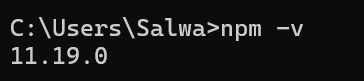

# 🐾   Praktikum Meyiapkan dan Memulai Pemrograman Mobile (React Native) #

### Tujuan Pembelajaran : ###
Mahasiswa mampu:
1. Menyiapkan dan Memulai Pemrograman Mobile (React Native)
2. Membuat Aplikasi Mobile (React Native)
3. Membuat CV sederhana dengan React Native

### Materi Pembelajaran ###
1. Menyiapkan dan Memulai Pemrograman Mobile (React Native)
   - Install Interpreter Node.JS
   - Download dan install node.js di alamat https://nodejs.org/en/download 
   - Konfirmasi versi node.js
   - node -v

        

   - Konfirmasi versi npm
   - npm -v

        

2. Membuat Aplikasi Mobile (React Native)
   - Untuk Referensi Dokumentasi Resmi milik Expo https://docs.expo.dev/ 
   - Untuk Referensi Dokumentasi Resmi milik React Native https://reactnative.dev/ 
   - Memulai Membuat projek baru dengan Framework Expo Go
   - Change directory ke folder praktikum (Pemrograman Mobile -> Pertemuan-2)
   - npx create-expo-app first commit --template blank