# 🐾 Modul Praktikum 4: Core Components & Styling #

## 🎯 Tujuan Pembelajaran

Setelah menyelesaikan praktikum ini, mahasiswa mampu:
1. Memahami dan menggunakan **16 Core Components** React Native
2. Menerapkan **StyleSheet** untuk styling terpusat
3. Menggunakan **useState** untuk state management dasar
4. Membuat layout yang responsif dengan **Flexbox**
5. Menangani **interaksi pengguna** (tekan, input, scroll)

## 🕵🏻‍♀️ Praktikum ##

### Langkah 1: Import Library & Components ###
1. Buka File App.js pada folder projek ptmn2
2. Impor Library dan Core Component yang dibutuhkan
3. Konfirmasi bukti

   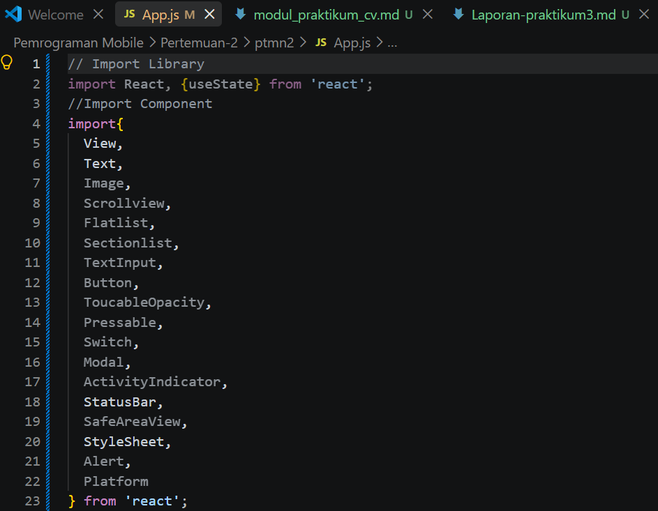

### Langkah 2: Menyiapkan Array Objek untuk menampung data ###

1. Membuat Array Objek bernama PROFILE untuk menampung data Profile
2. Konfirmasi bukti 

   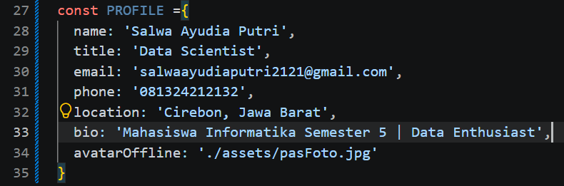

3. Membuat Array Objek bernama SKILLS untuk menampung data skills
4. Konfirmasi bukti

   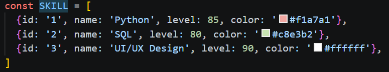

5. Membuat Array Objek bernama SECTIONS untuk menampung data riwayat pengalaman kerja dan pendidikan
6. Konfirmasi bukti

   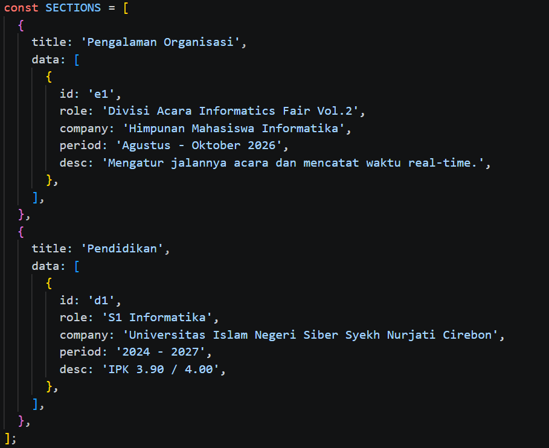

### Langkah 3: Membuat Sub-Components (SkillCard & TimelineCard)

1. Membuat sub-component SkillCard untuk menampilkan data skill serta riwayat pengalaman/pendidikan.
2. Konfirmasi bukti

   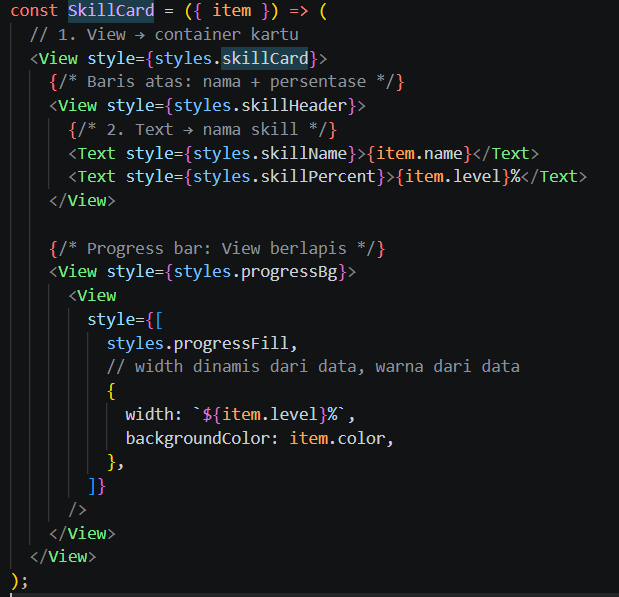
3. Membuat sub-component TimeLineCard untuk menampilkan data skill serta riwayat pengalaman/pendidikan.
4. Konfirmasi bukti

   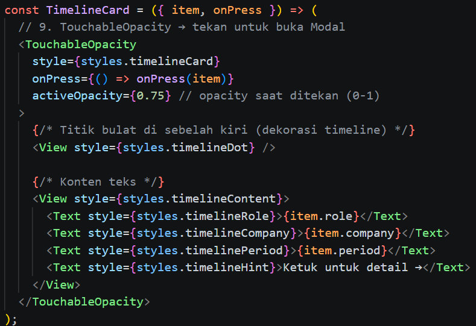

### Langkah 4: State Management dengan useState

1. Menambahkan useState untuk menyimpan data yang dapat berubah pada aplikasi.
2. State digunakan untuk mengatur kondisi seperti Open to Work, form input, loading, dan modal.
3. Setiap perubahan state akan menyebabkan komponen melakukan re-render.
4. ✅ Checkpoint: Aplikasi masih menampilkan teks, tidak ada error
5. Konfirmasi bukti

   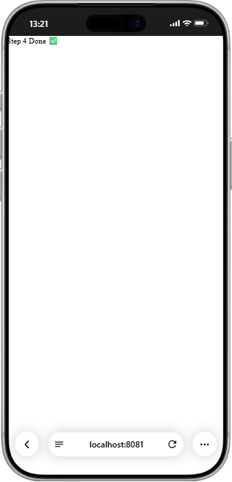

### Langkah 5: SafeAreaView, StatusBar & Header

1. Menggunakan SafeAreaView untuk memastikan tampilan aplikasi berada pada area aman perangkat
2. Membuat header menggunakan View dan Switch
3. Switch digunakan untuk mengubah status Open to Work
4. ✅ Checkpoint: Header bar berwarna gelap dengan teks putih dan switch terlihat.
5. Konfirmasi bukti
   
   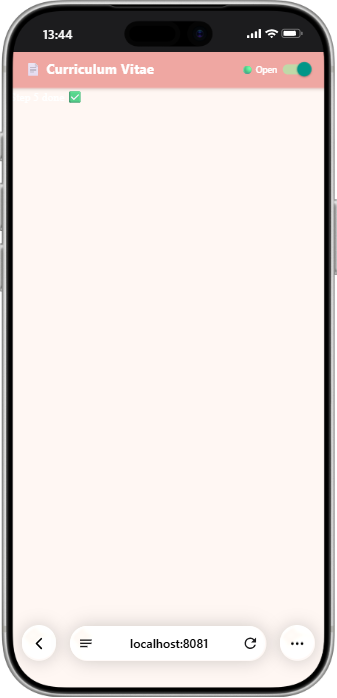

### Langkah 6: ScrollView & Profile Section (View, Text, img/image)

1. Menggunakan ScrollView untuk membuat seluruh isi CV dapat bergulir.
2. Menampilkan foto profile menggunakan komponen gambar.
3. Menampilkan informasi profile seperti nama, jabatan, dan bio.
4. Menambahkan tombol media sosial menggunakan komponen interaksi pengguna.
5. ✅ Checkpoint: Foto profile, nama, jabatan, bio, dan tombol sosmed terlihat.
6. Konfirmasi bukti

   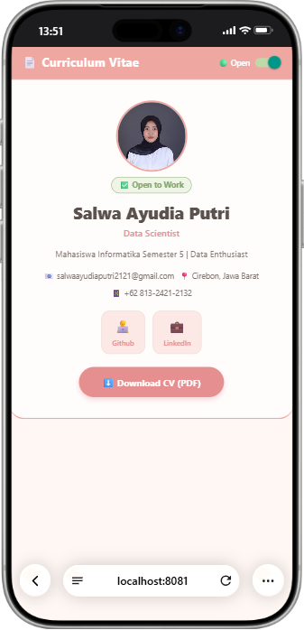

### Langkah 7: Flatlist (Daftar Skills)

1. Menampilkan data skills menggunakan komponen Flatlist.
2. Flatlist digunakan untuk menampilkan data dalam bentuk daftar secara efisien.
3. Data yang ditampilkan berasal dari array objek SKILLS.
4. Setiap skill ditampilkan dalam bentuk card yang memiliki progress bar sesuai persentase kemampuan.
5. ✅ Checkpoint: Daftar skill dengan progress bar berwarna-warni terlihat.
6. Konfirmasi bukti

   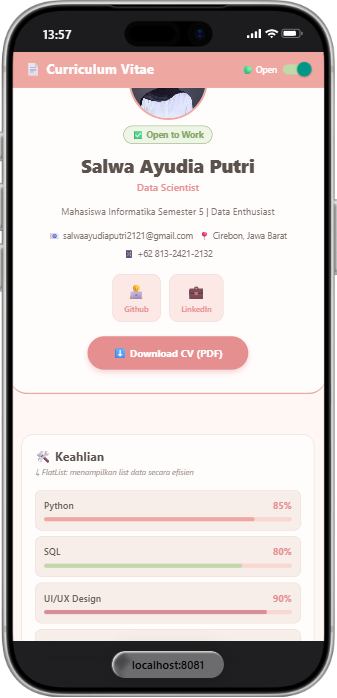

### Langkah 8: SectionList (Pengalaman & Pendidikan)

1. Menampilkan data pengalaman dan pendidikan menggunakan SectionList.
2. Data dikelompokkan berdasarkan kategori atau section.
3. Section digunakan untuk memisahkan bagian pengalaman kerja/organisasi dan riwayat pendidikan.
4. Setiap data ditampilkan menggunakan TimeLineCard
5. ✅ Checkpoint: Daftar pengalaman kerja & pendidikan terkelompok terlihat.
6. Konfirmasi bukti

   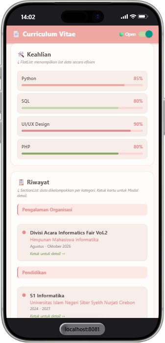

## Langkah 9: TextInput, Button & ActivityIndicator

1. Membuat form kontak menggunakan TextInput untuk menerima input dari pengguna.
2. Menggunakan Button sebagai tombol untuk mengirim pesan.
3. Menggunakan ActivityIndicator sebagai indikator ketika proses pengiriman sedang berlangsung.
4. Input nama dan pesan dikontrol menggunakan state.
5. Setelah tombol kirim ditekan, aplikasi menampilkan proses loading kemudian memberikan notifikasi bahwa pesan berhasil dikirim.
6. ✅ Checkpoint: Form input nama dan pesan berfungsi. Tekan "Kirim Pesan" → loading 2 detik → ALert sukses.
7. Konfirmasi bukti

   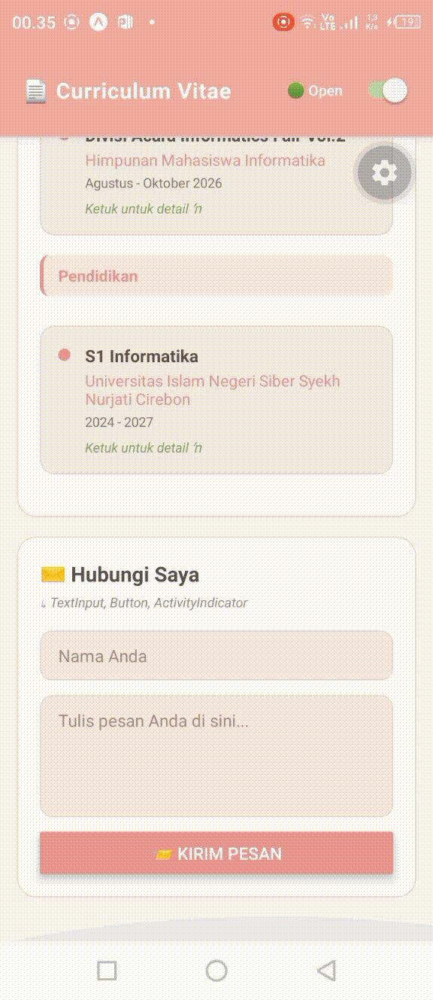

### Langkah 10: Modal (Popup Detail)

1. Menambahkan komponen Modal untuk menampilkan detail riwayat.
2. Modal ditampilkan ketika pengguna menekan kartu riwayat.
3. Modal digunakan animasi slide sehingga muncul dari bagian bawah layar.
4. Menambahkan tombol Tutup untuk modal.
5. ✅ Checkpoint: Ketuk kartu riwayat → modal muncul dari bawah → tombol Tutup menutup modal.
6. Konfirmasi bukti
   - Pengalaman Organisasi

     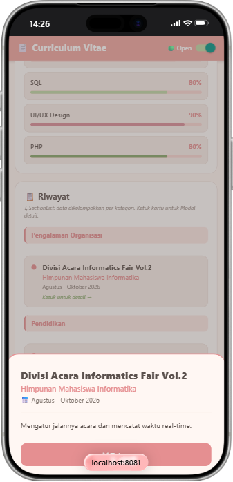

   - Riwayat Pendidikan
   
     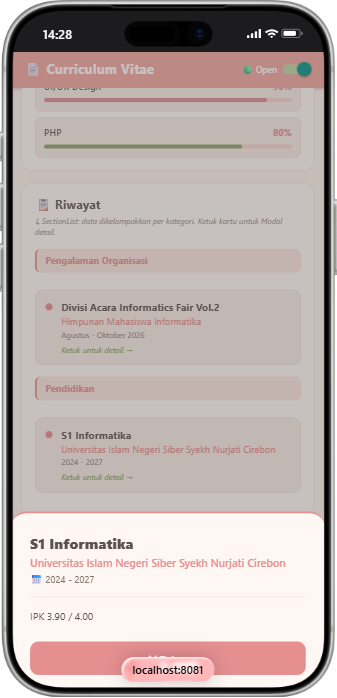

### Langkah 11: StyleSheet (Styling Terpusat)
1. Membuat konstanta warna untuk mengatur palet warna aplikasi.
2. Menggunakan StyleSheet.create() untuk mengatur seluruh tampilan aplikasi secara terpusat.
3. Styling diterapkan pada bagian header, profile, sosial media, section, skill card, timeline card, form input, loading, dan modal
4. Penggunaan StyleSheet membuat kode styling lebih terorganisir dan mudah dikelola.

   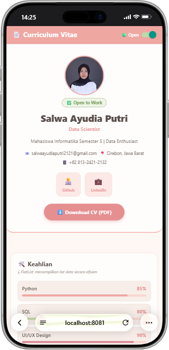

### Langkah 12: Verifikasi & Pengujian

1. Hasil pengujian dan Tugas pengembangan

   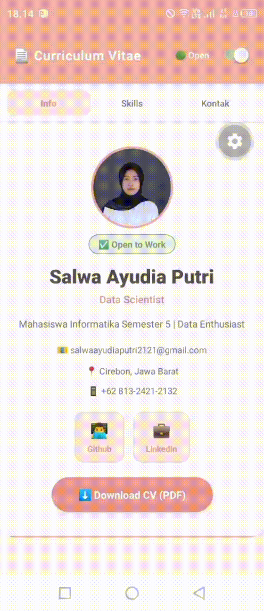