# 🐾 Modul Praktikum 4: Core Components & Styling #

## 🎯 Tujuan Pembelajaran

Setelah menyelesaikan praktikum ini, mahasiswa mampu:
1. Memahami dan menggunakan **16 Core Components** React Native
2. Menerapkan **StyleSheet** untuk styling terpusat
3. Menggunakan **useState** untuk state management dasar
4. Membuat layout yang responsif dengan **Flexbox**
5. Menangani **interaksi pengguna** (tekan, input, scroll)

## 🕵🏻‍♀️ Praktikum ##

### Langkah 1: Import Library & Components ###
1. Buka File App.js pada folder projek ptmn2
2. Impor Library dan Core Component yang dibutuhkan
3. Konfirmasi bukti

   

### Langkah 2: Menyiapkan Array Objek untuk menampung data ###

1. Membuat Array Objek bernama PROFILE untuk menampung data Profile
2. Konfirmasi bukti 

   

3. Membuat Array Objek bernama SKILLS untuk menampung data skills
4. Konfirmasi bukti

   
5. Membuat Secions bernama SECTIONS untuk menampung data riwayat pengalaman kerja dan pendidikan
6. Konfirmasi bukti

   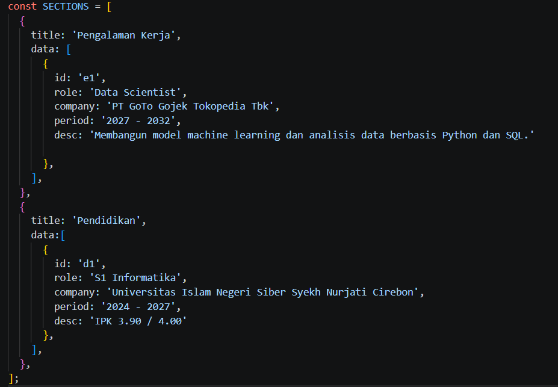

### Langkah 3: Sub-Components (SkillCard & TimelineCard)

1. SkillCard
2. Konfirmasi bukti

   
3. TimelineCard
4. Konfirmasi bukti

   

### Langkah 4: State Management dengan useState

1. State Management dengan useState
2. Konfirmasi bukti

   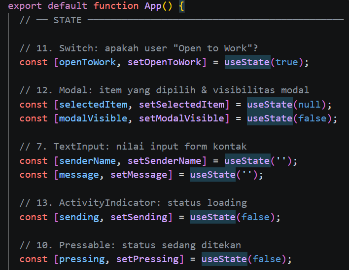

### Langkah 5: SafeAreaView, StatusBar & Header

1. SafeAreaView
2. Konfirmasi bukti

   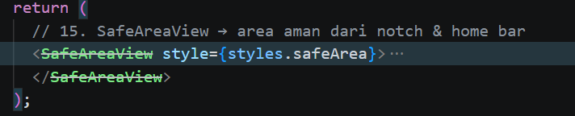
3. StatusBar
4. Konfirmasi bukti

   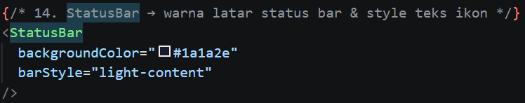
5. Header
6. Konfirmasi bukti

   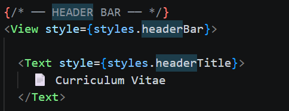

### Langkah 6: ScrollView & Profile Section (View, Text, img/image)

1. ScrollView
2. Konfirmasi bukti

   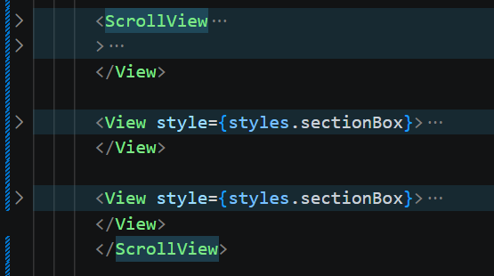
3. Profile Section
4. Konfirmasi bukti

   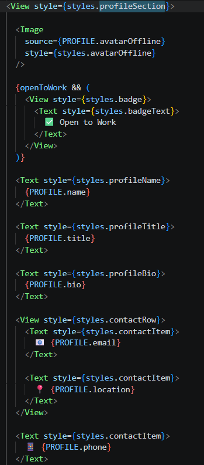

### Langkah 7: Flatlist (Daftar Skills)

1. Flatlist
2. Konfirmasi bukti

   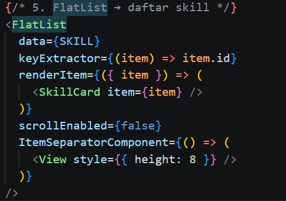

### Langkah 8: SectionList (Pengalaman & Pendidikan)

1. SectionList (Pengalaman & Pendidikan)
2. Konfirmasi bukti

   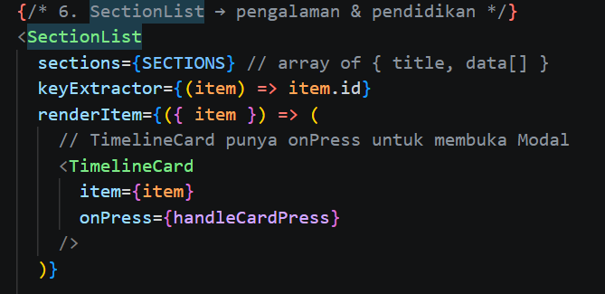

## Langkah 9: TextInput, Button & ActivityIndicator

1. TextInput, Button & ActivityIndicator'
2. Konfirmasi bukti

   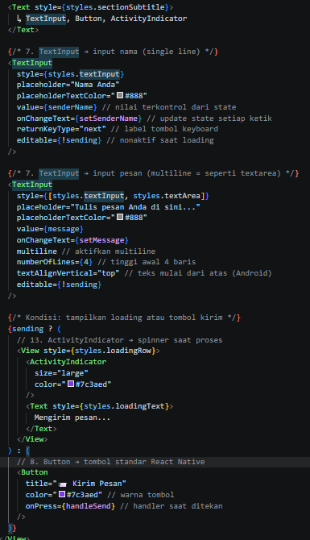

### Langkah 10: Modal (Popup Detail)

1. Modal (Popup Detail)
2. Konfirmasi bukti

   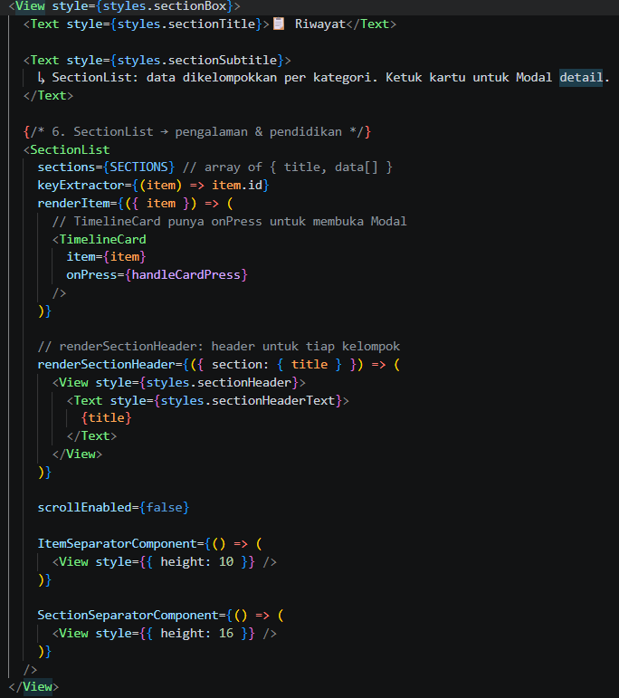

### Langkah 11: StyleSheet (Styling Terpusat)
1. StyleSheet (Styling Terpusat)
2. Konfirmasi bukti

   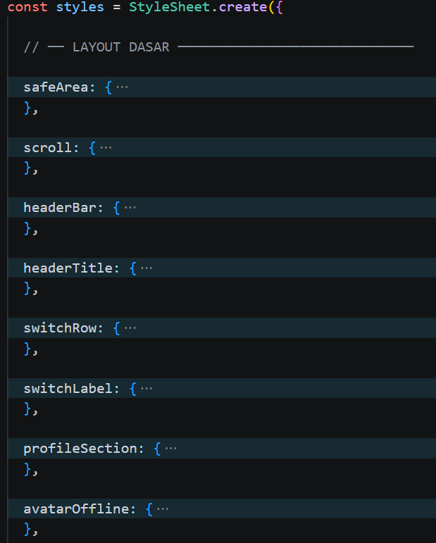

### Langkah 12: Verifikasi & Pengujian

1. Hasil pengujian

   