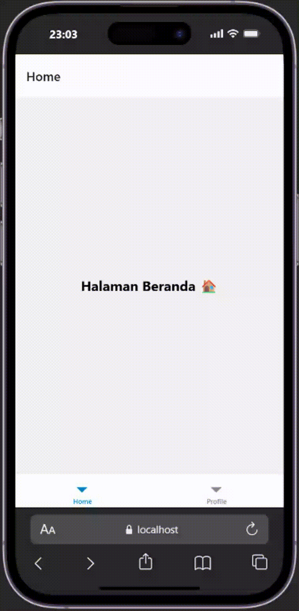
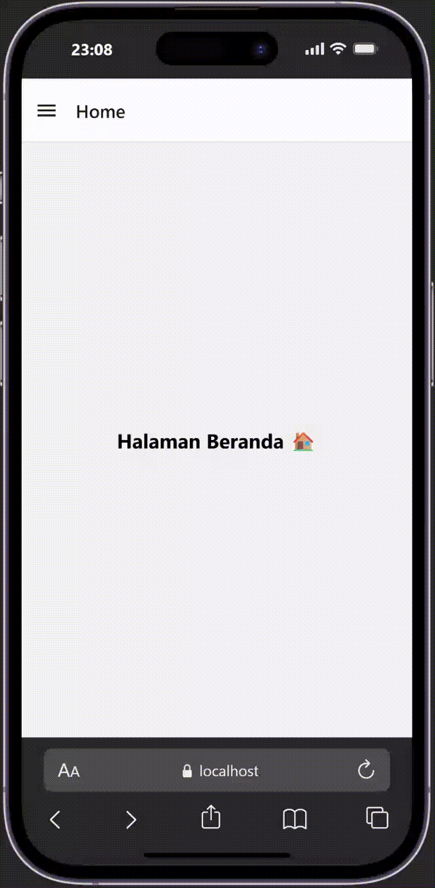

# NAVIGATION in REACT NATIVE #

### Tujuan Pembelajaran ###
Setelah mengikuti praktikum ini, mahasiswa diharapkan mampu:
1. Menggunakan navigasi antar halaman menggunakan komponen navigation pada React Native
2. Menggunakan props untuk mengirimkan data antar halaman
3. Membuat navigasi stack, tab dan Drawer Navigation

### Langkah 1: Persiapan Projek Navigasi ###
1. Membuat Projek baru bernama ptmn4 (npx create-expo-app ptmn4 --template blank)
2. Change Directory ke ptmn4 (cd ptmn4)
3. Install Core navigation library (npm install @react-navigation/native)
4. install dependensi pendukung (wajib untuk Expo) (npx expo install react-native-screens-react-native-safe-area-context react-native-gesture-handler react-native-reanimated)

### Langkah 2: Membuat Stack Navigation ###
1. install library untuk navigation stack (npm install @react-navigation/native-stack)
2. buat Folder screens
3. buat File Login.js dan Signup.js di folder screens
4. Sesuaikan isi file dengan App.js dengan yang ada di modul
5. Install untuk Web Emulator (npx expo install react--dom react-native-web)
6. npx expo start --web
7. Konfimasi Bukti

    

### Langkah 3: Bottom Tab Navigation ###
1. Instalasi Pustaka Bottom Tabs (npm install @react-navigation/bottom-tabs)
2. Buat file HomeScreen.js dan ProfileScreen.js di dalam folder screens
3. Sesuaikan isi file App.js dengan yang ada di modul bagian Bottom Tab Navigation
4. Konfirmasi bukti

    

### Langkah 4: Drawer Navigation ###
1. Instalasi Pustaka Bottom Tabs (npm install @react-navigation/bottom-tabs)
2. Buat file HomeScreen.js dan ProfileScreen.js di dalam folder screens
3. Sesuaikan isi file App.js dengan yang ada di modul bagian Bottom Tab Navigation
4. Konfirmasi bukti

    
